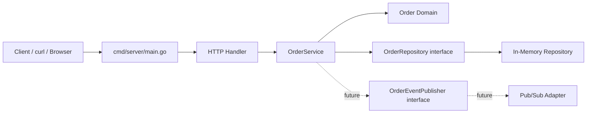
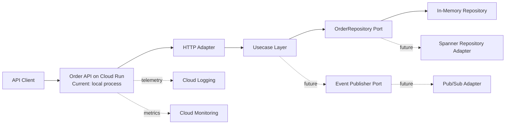
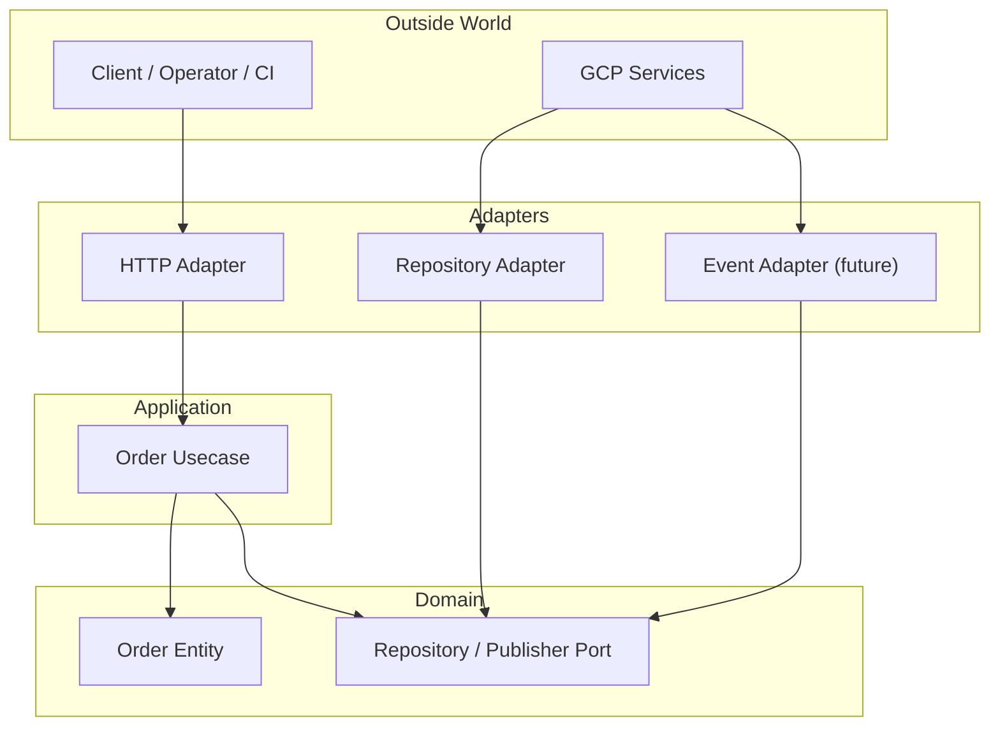
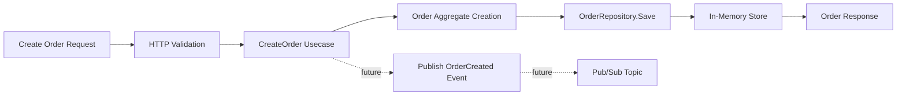
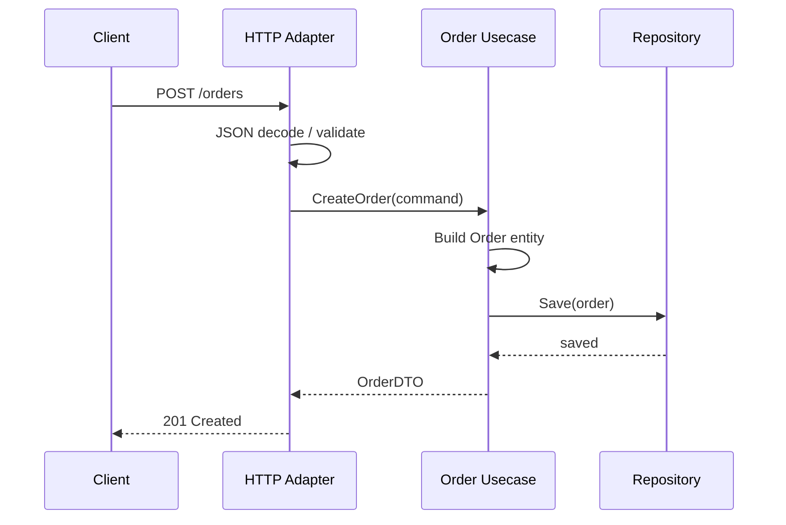
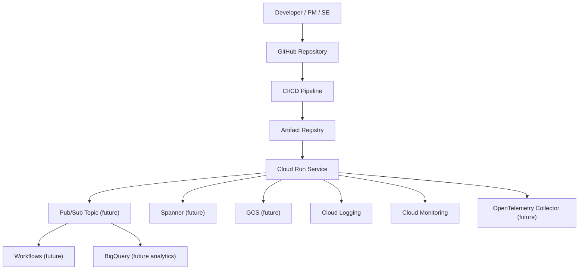
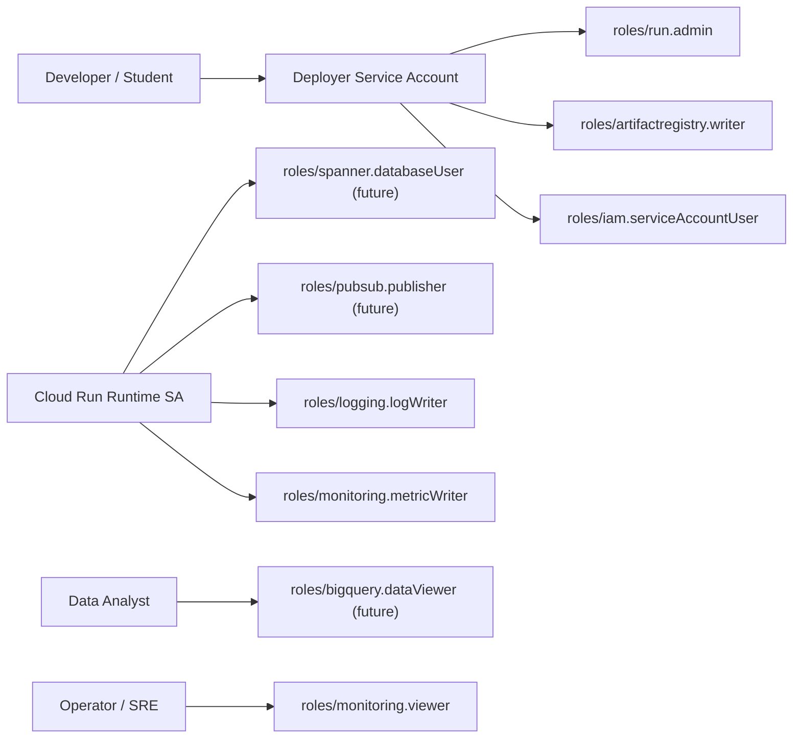
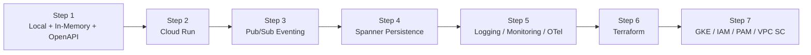

# gcp-service-learning

OpenAPI 定義から始める Go 注文 API と、GCP 実践学習教材を同居させたリポジトリです。  
このリポジトリの主目的はアプリ開発そのものではなく、GCP 案件に参画する PM/SE が主要サービスを構成・責務・運用観点まで含めて学べる教材土台を作ることです。

## この教材で学ぶこと

- OpenAPI を起点に API の責務を整理する方法
- Go のヘキサゴナルアーキテクチャで GCP 依存を adapter に閉じ込める方法
- Cloud Run / Spanner / Pub/Sub へ段階的に拡張する設計の考え方
- ネットワーク、IAM、運用監視を実装と一緒に読む方法
- PM/SE が設計レビューで見るべき論点

## この教材の読み方

この repo は「README を読んで終わり」ではなく、STEP 単位で読み進める教材として設計します。

1. 全体像を掴む: [docs/learning-roadmap.md](/Users/mn/Documents/Codex/2026-06-03/aof-go-openapi-api-github-aof/docs/learning-roadmap.md)
2. 現在の実装を学ぶ: [docs/steps/step-01-openapi-go-inmemory.md](/Users/mn/Documents/Codex/2026-06-03/aof-go-openapi-api-github-aof/docs/steps/step-01-openapi-go-inmemory.md)
3. Cloud Run への載せ方を学ぶ: [docs/steps/step-02-cloud-run.md](/Users/mn/Documents/Codex/2026-06-03/aof-go-openapi-api-github-aof/docs/steps/step-02-cloud-run.md)
4. デプロイと IAM を学ぶ: [docs/steps/step-03-deploy-and-iam.md](/Users/mn/Documents/Codex/2026-06-03/aof-go-openapi-api-github-aof/docs/steps/step-03-deploy-and-iam.md)
5. ファイルの意味を引く: [docs/reference/repository-map.md](/Users/mn/Documents/Codex/2026-06-03/aof-go-openapi-api-github-aof/docs/reference/repository-map.md)
6. コードをブロックごとに読む: [docs/reference/code-walkthrough.md](/Users/mn/Documents/Codex/2026-06-03/aof-go-openapi-api-github-aof/docs/reference/code-walkthrough.md)
7. AOF の運用を読む: [docs/reference/aof-operations.md](/Users/mn/Documents/Codex/2026-06-03/aof-go-openapi-api-github-aof/docs/reference/aof-operations.md)
8. GitHub Actions deploy を読む: [docs/reference/github-actions-deploy.md](/Users/mn/Documents/Codex/2026-06-03/aof-go-openapi-api-github-aof/docs/reference/github-actions-deploy.md)
9. GCP サービス単位で広げる: [docs/README.md](/Users/mn/Documents/Codex/2026-06-03/aof-go-openapi-api-github-aof/docs/README.md)

## 初期スコープ

- `POST /orders`
- `GET /orders/{orderId}`
- 保存先はインメモリ
- OpenAPI 定義あり
- Go
- ヘキサゴナルアーキテクチャ

## クイックスタート

1. OpenAPI 定義を確認する: [api/openapi.yaml](/Users/mn/Documents/Codex/2026-06-03/aof-go-openapi-api-github-aof/api/openapi.yaml)
2. サーバーを起動する: `go run ./cmd/server`
3. 注文を作成する:

```bash
curl -X POST http://localhost:8080/orders \
  -H 'Content-Type: application/json' \
  -d '{
    "customerId": "cust-001",
    "items": [
      { "productId": "book-001", "quantity": 2 }
    ]
  }'
```

4. 取得する:

```bash
curl http://localhost:8080/orders/<orderId>
```

## リポジトリ構成

```text
.
├── api/                         # OpenAPI 定義
├── cmd/server/                  # エントリポイント
├── internal/domain/             # ドメインモデルと port
├── internal/application/        # ユースケース
├── internal/adapters/http/      # HTTP adapter
├── internal/adapters/repository # 保存先 adapter
├── docs/                        # GCP 学習教材
│   ├── steps/                   # STEP 単位の学習ガイド
│   └── reference/               # ファイルとコードの読解ガイド
├── infra/cloud-run/             # Cloud Run 配備テンプレート
├── .github/workflows/           # AOF / deploy workflow
└── .aof/                        # AOF の framing / governance / decisions
```

## 実装の読み解き図



この図は「どこにコードがあるか」ではなく、「どこで責務が切れているか」を見るための図です。

## システムアーキテクチャ図



## レイヤ構成図



## データフロー図



## API シーケンス図



## GCP リソース関連図



## IAM 関係図



## 学習観点

### このサンプルで今すぐ学べること

- OpenAPI と実装の対応関係
- レイヤ分離の意味
- repository port による保存先差し替え準備
- 将来のイベント発行 port を先に意識した設計

### 将来追加で深掘ること

- Cloud Run へのデプロイ
- Pub/Sub による非同期イベント化
- Spanner への永続化
- Cloud Logging / Monitoring / OpenTelemetry による運用可視化
- Terraform による IaC
- GKE, PAM, VPC Service Controls を使った高度化

## 設計原則

- `domain/usecase` は GCP SDK に依存しない
- GCP SDK は adapter 層に限定する
- repository は interface 化する
- Spanner 実装へ差し替え可能にする
- Pub/Sub イベント発行へ拡張可能にする

## AOF の適用

このリポジトリでは AOF を「実装フレームワーク」ではなく「学習教材を成長させるための判断記録フレーム」として使います。

- Request Framing: [.aof/context/request-framing.md](/Users/mn/Documents/Codex/2026-06-03/aof-go-openapi-api-github-aof/.aof/context/request-framing.md)
- Governance: [.aof/governance/governance.md](/Users/mn/Documents/Codex/2026-06-03/aof-go-openapi-api-github-aof/.aof/governance/governance.md)
- Decision Record: [.aof/decisions/DEC-001-bootstrap-learning-repo.md](/Users/mn/Documents/Codex/2026-06-03/aof-go-openapi-api-github-aof/.aof/decisions/DEC-001-bootstrap-learning-repo.md)

### AOF Runtime / CLI

この repo は AOF v1.10.0 の runtime / CLI を `tools/aof-runtime/` に同梱し、project-local な `.aof/` state を持つ構成にしています。

```bash
npm run aof -- run "AOF runtime でこの repo を運用したい" --project .
npm run aof -- answer --session ./.aof/sessions/<SESSION>.json --response "..."
npm run aof -- council --session ./.aof/sessions/<SESSION>.json --stage planning --project .
npm run aof -- council-exec --session ./.aof/sessions/<SESSION>.json --stage planning --project . --invoke-model --provider mock
```

### Visibility Service

live `.aof/` state から visibility 用 JSON を生成して viewer を起動できます。

```bash
npm run aof:visibility:build
npm run aof:visibility:serve
```

生成先:

- [.aof/artifacts/visibility/status-card.json](/Users/mn/Documents/Codex/2026-06-03/aof-go-openapi-api-github-aof/.aof/artifacts/visibility/status-card.json)
- [.aof/artifacts/visibility/timeline-feed.json](/Users/mn/Documents/Codex/2026-06-03/aof-go-openapi-api-github-aof/.aof/artifacts/visibility/timeline-feed.json)
- [.aof/artifacts/visibility/flow-snapshot.json](/Users/mn/Documents/Codex/2026-06-03/aof-go-openapi-api-github-aof/.aof/artifacts/visibility/flow-snapshot.json)

### GitHub Actions Cadence

`github_actions` scheduler profile に合わせて、AOF cadence を定期実行する workflow を追加しています。

- Workflow: [.github/workflows/aof-cadence.yml](/Users/mn/Documents/Codex/2026-06-03/aof-go-openapi-api-github-aof/.github/workflows/aof-cadence.yml)
- 運用ガイド: [docs/reference/aof-operations.md](/Users/mn/Documents/Codex/2026-06-03/aof-go-openapi-api-github-aof/docs/reference/aof-operations.md)
- 主な役割:
  - `cadence-cycle` を 1 時間ごとに実行
  - visibility JSON を再生成
  - `.aof` 更新があれば commit / push

## 学習ロードマップ



STEP ごとの詳説:

- ロードマップ本体: [docs/learning-roadmap.md](/Users/mn/Documents/Codex/2026-06-03/aof-go-openapi-api-github-aof/docs/learning-roadmap.md)
- Step 1: [docs/steps/step-01-openapi-go-inmemory.md](/Users/mn/Documents/Codex/2026-06-03/aof-go-openapi-api-github-aof/docs/steps/step-01-openapi-go-inmemory.md)
- Step 2: [docs/steps/step-02-cloud-run.md](/Users/mn/Documents/Codex/2026-06-03/aof-go-openapi-api-github-aof/docs/steps/step-02-cloud-run.md)
- Step 3: [docs/steps/step-03-deploy-and-iam.md](/Users/mn/Documents/Codex/2026-06-03/aof-go-openapi-api-github-aof/docs/steps/step-03-deploy-and-iam.md)
- リポジトリマップ: [docs/reference/repository-map.md](/Users/mn/Documents/Codex/2026-06-03/aof-go-openapi-api-github-aof/docs/reference/repository-map.md)
- コードウォークスルー: [docs/reference/code-walkthrough.md](/Users/mn/Documents/Codex/2026-06-03/aof-go-openapi-api-github-aof/docs/reference/code-walkthrough.md)
- AOF 運用ガイド: [docs/reference/aof-operations.md](/Users/mn/Documents/Codex/2026-06-03/aof-go-openapi-api-github-aof/docs/reference/aof-operations.md)
- GitHub Actions Deploy ガイド: [docs/reference/github-actions-deploy.md](/Users/mn/Documents/Codex/2026-06-03/aof-go-openapi-api-github-aof/docs/reference/github-actions-deploy.md)

## docs ガイド

- 全体ガイド: [docs/README.md](/Users/mn/Documents/Codex/2026-06-03/aof-go-openapi-api-github-aof/docs/README.md)
- ネットワークとセキュリティ観点: [docs/network-and-security.md](/Users/mn/Documents/Codex/2026-06-03/aof-go-openapi-api-github-aof/docs/network-and-security.md)
- Cloud Run: [docs/services/cloud-run.md](/Users/mn/Documents/Codex/2026-06-03/aof-go-openapi-api-github-aof/docs/services/cloud-run.md)
- Pub/Sub: [docs/services/pubsub.md](/Users/mn/Documents/Codex/2026-06-03/aof-go-openapi-api-github-aof/docs/services/pubsub.md)
- GCS: [docs/services/gcs.md](/Users/mn/Documents/Codex/2026-06-03/aof-go-openapi-api-github-aof/docs/services/gcs.md)
- BigQuery: [docs/services/bigquery.md](/Users/mn/Documents/Codex/2026-06-03/aof-go-openapi-api-github-aof/docs/services/bigquery.md)
- Spanner: [docs/services/spanner.md](/Users/mn/Documents/Codex/2026-06-03/aof-go-openapi-api-github-aof/docs/services/spanner.md)
- Workflows: [docs/services/workflows.md](/Users/mn/Documents/Codex/2026-06-03/aof-go-openapi-api-github-aof/docs/services/workflows.md)
- Cloud Logging: [docs/services/cloud-logging.md](/Users/mn/Documents/Codex/2026-06-03/aof-go-openapi-api-github-aof/docs/services/cloud-logging.md)
- Cloud Monitoring: [docs/services/cloud-monitoring.md](/Users/mn/Documents/Codex/2026-06-03/aof-go-openapi-api-github-aof/docs/services/cloud-monitoring.md)
- OpenTelemetry: [docs/services/opentelemetry.md](/Users/mn/Documents/Codex/2026-06-03/aof-go-openapi-api-github-aof/docs/services/opentelemetry.md)
- Terraform: [docs/services/terraform.md](/Users/mn/Documents/Codex/2026-06-03/aof-go-openapi-api-github-aof/docs/services/terraform.md)
- GKE: [docs/services/gke.md](/Users/mn/Documents/Codex/2026-06-03/aof-go-openapi-api-github-aof/docs/services/gke.md)
- IAM: [docs/services/iam.md](/Users/mn/Documents/Codex/2026-06-03/aof-go-openapi-api-github-aof/docs/services/iam.md)
- PAM: [docs/services/pam.md](/Users/mn/Documents/Codex/2026-06-03/aof-go-openapi-api-github-aof/docs/services/pam.md)
- VPC Service Controls: [docs/services/vpc-service-controls.md](/Users/mn/Documents/Codex/2026-06-03/aof-go-openapi-api-github-aof/docs/services/vpc-service-controls.md)
