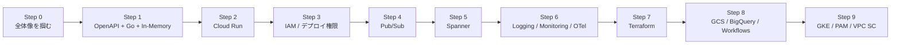

# 学習ロードマップ

この教材は、実装を増やす順番ではなく、GCP 案件で PM/SE が理解すべき論点を段階的に学べる順番で構成します。

## 全体像

## Step 0: 全体像を掴む

- 読むファイル:
  - [README.md](/Users/mn/Documents/Codex/2026-06-03/aof-go-openapi-api-github-aof/README.md)
  - [docs/reference/repository-map.md](/Users/mn/Documents/Codex/2026-06-03/aof-go-openapi-api-github-aof/docs/reference/repository-map.md)
- 目的:
  - この repo が「アプリ」ではなく「学習教材」であると理解する
  - どのレイヤが GCP 非依存で、どこから GCP を差し込むのか掴む
- つまづきポイント:
  - いきなり `cmd/server` から読み始めて、設計意図を見失いやすい
- ベテランからのアドバイス:
  - まずファイル一覧を見て、責務の分割単位が意図的かを確認する

## Step 1: OpenAPI + Go + In-Memory

- 読むファイル:
  - [docs/steps/step-01-openapi-go-inmemory.md](/Users/mn/Documents/Codex/2026-06-03/aof-go-openapi-api-github-aof/docs/steps/step-01-openapi-go-inmemory.md)
  - [docs/reference/code-walkthrough.md](/Users/mn/Documents/Codex/2026-06-03/aof-go-openapi-api-github-aof/docs/reference/code-walkthrough.md)
- 目的:
  - API 契約から実装へ落とす流れを理解する
  - ヘキサゴナルアーキテクチャの最小構成を把握する
- 得られること:
  - Cloud Run 前でも、責務分離と差し替え点を先に設計できる

## Step 2: Cloud Run

- 読むファイル:
  - [docs/services/cloud-run.md](/Users/mn/Documents/Codex/2026-06-03/aof-go-openapi-api-github-aof/docs/services/cloud-run.md)
- 目的:
  - ローカルの `go run` が Cloud Run 上のコンテナ実行にどう変わるか理解する
- 意識点:
  - HTTP ポート、ヘルスチェック、コンテナ起動失敗時の見え方

## Step 3: IAM / デプロイ権限

- 読むファイル:
  - [docs/services/iam.md](/Users/mn/Documents/Codex/2026-06-03/aof-go-openapi-api-github-aof/docs/services/iam.md)
  - [docs/network-and-security.md](/Users/mn/Documents/Codex/2026-06-03/aof-go-openapi-api-github-aof/docs/network-and-security.md)
- 目的:
  - 誰が deploy できるか、実行主体が何に触れるかを分離して考える
- PM 観点:
  - 権限の説明責任は設計書より運用設計で問われやすい

## Step 4: Pub/Sub

- 読むファイル:
  - [docs/services/pubsub.md](/Users/mn/Documents/Codex/2026-06-03/aof-go-openapi-api-github-aof/docs/services/pubsub.md)
- 目的:
  - 同期 API と非同期イベントの責務の違いを理解する
- 意識点:
  - 将来拡張用の `OrderEventPublisher` port がなぜ先にあるか

## Step 5: Spanner

- 読むファイル:
  - [docs/services/spanner.md](/Users/mn/Documents/Codex/2026-06-03/aof-go-openapi-api-github-aof/docs/services/spanner.md)
- 目的:
  - In-Memory Repository を永続ストアへ差し替えるポイントを理解する
- 意識点:
  - domain / usecase を変えず adapter だけ置換できる設計価値

## Step 6: Logging / Monitoring / OpenTelemetry

- 読むファイル:
  - [docs/services/cloud-logging.md](/Users/mn/Documents/Codex/2026-06-03/aof-go-openapi-api-github-aof/docs/services/cloud-logging.md)
  - [docs/services/cloud-monitoring.md](/Users/mn/Documents/Codex/2026-06-03/aof-go-openapi-api-github-aof/docs/services/cloud-monitoring.md)
  - [docs/services/opentelemetry.md](/Users/mn/Documents/Codex/2026-06-03/aof-go-openapi-api-github-aof/docs/services/opentelemetry.md)
- 目的:
  - 「動く」から「見える」への移行を理解する

## Step 7: Terraform

- 読むファイル:
  - [docs/services/terraform.md](/Users/mn/Documents/Codex/2026-06-03/aof-go-openapi-api-github-aof/docs/services/terraform.md)
- 目的:
  - 手動構築を再現可能な構成へ昇華する

## Step 8: GCS / BigQuery / Workflows

- 読むファイル:
  - [docs/services/gcs.md](/Users/mn/Documents/Codex/2026-06-03/aof-go-openapi-api-github-aof/docs/services/gcs.md)
  - [docs/services/bigquery.md](/Users/mn/Documents/Codex/2026-06-03/aof-go-openapi-api-github-aof/docs/services/bigquery.md)
  - [docs/services/workflows.md](/Users/mn/Documents/Codex/2026-06-03/aof-go-openapi-api-github-aof/docs/services/workflows.md)
- 目的:
  - 業務データの保管、分析、業務オーケストレーションの違いを学ぶ

## Step 9: GKE / PAM / VPC Service Controls

- 読むファイル:
  - [docs/services/gke.md](/Users/mn/Documents/Codex/2026-06-03/aof-go-openapi-api-github-aof/docs/services/gke.md)
  - [docs/services/pam.md](/Users/mn/Documents/Codex/2026-06-03/aof-go-openapi-api-github-aof/docs/services/pam.md)
  - [docs/services/vpc-service-controls.md](/Users/mn/Documents/Codex/2026-06-03/aof-go-openapi-api-github-aof/docs/services/vpc-service-controls.md)
- 目的:
  - 大規模運用や高統制環境で増える論点を把握する
