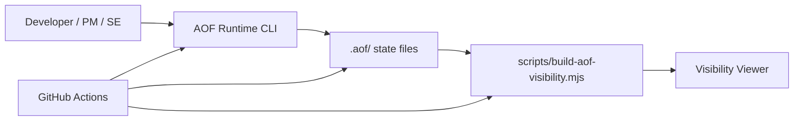
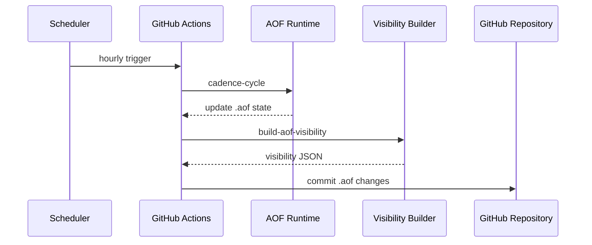

# AOF 運用ガイド

このドキュメントは、この repo で AOF runtime / visibility / GitHub Actions がどうつながるかを説明します。

## 何を目指しているか

- AOF の判断履歴を `.aof/` に残す
- visibility で現在の状態を見えるようにする
- GitHub Actions で cadence を定期実行し、放置された状態を減らす

## 構成図



## 主要ファイル

- [package.json](/Users/mn/Documents/Codex/2026-06-03/aof-go-openapi-api-github-aof/package.json)
  - `npm run aof`
  - `npm run aof:visibility:build`
  - `npm run aof:visibility:serve`

- [tools/aof-runtime/src/cli.js](/Users/mn/Documents/Codex/2026-06-03/aof-go-openapi-api-github-aof/tools/aof-runtime/src/cli.js)
  - AOF runtime の CLI 本体

- [scripts/build-aof-visibility.mjs](/Users/mn/Documents/Codex/2026-06-03/aof-go-openapi-api-github-aof/scripts/build-aof-visibility.mjs)
  - `.aof/` を visibility 向け JSON に投影する

- [.github/workflows/aof-cadence.yml](/Users/mn/Documents/Codex/2026-06-03/aof-go-openapi-api-github-aof/.github/workflows/aof-cadence.yml)
  - cadence を GitHub Actions で定期実行する

## ローカルでの使い方

### runtime

```bash
npm run aof -- run "AOF runtime でこの repo を運用したい" --project .
```

### visibility 更新

```bash
npm run aof:visibility:build
```

### visibility 起動

```bash
node ./tools/aof-runtime/src/cli.js visibility-serve \
  --status-input ./.aof/artifacts/visibility/status-card.json \
  --timeline-input ./.aof/artifacts/visibility/timeline-feed.json \
  --flow-input ./.aof/artifacts/visibility/flow-snapshot.json \
  --port 4181 \
  --title "GCP Service Learning AOF Visibility"
```

## GitHub Actions で何をしているか



### workflow の意味

- `schedule`
  - 1 時間ごとに cadence を確認する
- `cadence-cycle`
  - AOF の cadence 状態を進める
- `build-aof-visibility`
  - 最新の `.aof` state から viewer 用 JSON を再生成する
- `upload-artifact`
  - workflow 実行結果として visibility JSON を残す
- `commit`
  - `.aof` の更新があれば履歴として GitHub に残す

## この設計で得られること

- AOF の運用が「人が覚えていれば回る」状態から一歩進む
- cadence の実行結果が repo に残る
- visibility の元データが定期更新される

## 初心者のつまづきポイント

- visibility viewer は起動し続けるプロセスだが、GitHub Actions は viewer 自体を常駐させない
- Actions で更新されるのは `.aof/` と visibility JSON であり、ローカルブラウザ表示は別途 `visibility-serve` が必要
- cadence が回っても、必ず何か大きな変化が起こるわけではない

## ベテランからのアドバイス

- `.aof` を commit 対象にするなら、自動更新の粒度を最初から設計しておくと履歴が読みやすい
- schedule は細かすぎるとノイズになるので、教材 repo なら hourly くらいがちょうどよい
- viewer は「運用画面」であって「真実のデータ本体」ではないと意識すると混乱しにくい
