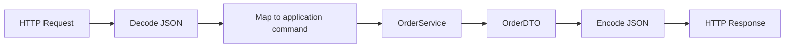

# コードウォークスルー

このドキュメントは、実装を「ファイル単位」ではなく「意味のあるブロック単位」で読むための案内です。

## 1. OpenAPI 定義

対象:
- [api/openapi.yaml](/Users/mn/Documents/Codex/2026-06-03/aof-go-openapi-api-github-aof/api/openapi.yaml:1)

### ブロック: API の入り口定義

- `paths./orders.post`: 注文作成
- `paths./orders/{orderId}.get`: 注文取得

何をしているか:
- クライアントがどの URL に何を送るかを固定している

結果:
- 実装側は契約に合わせて handler を作ればよい

つまづきポイント:
- OpenAPI を書いた時点で実装が自動で一致するわけではない

## 2. main 関数の配線

対象:
- [cmd/server/main.go](/Users/mn/Documents/Codex/2026-06-03/aof-go-openapi-api-github-aof/cmd/server/main.go:14)

### ブロック: 実装選択

- `memoryrepo.NewOrderRepository()`
- `application.NewOrderService(...)`
- `httpadapter.NewHandler(service)`

何をしているか:
- どの adapter を使うかを `main` で決めている

結果:
- 将来 `memory` を `spanner` に差し替える変更が `main` 周辺に集まりやすい

ベテラン視点:
- 依存注入ライブラリがなくても、最小構成なら `main` の手配線で十分読みやすい

### ブロック: HTTP サーバ起動

- `http.Server{...}`
- `ListenAndServe()`

何をしているか:
- ルーティング済み handler をポートに公開する

結果:
- ローカルでは `go run ./cmd/server` で確認できる
- 将来は Cloud Run のコンテナ入口になる

## 3. HTTP handler の責務

対象:
- [internal/adapters/http/handler.go](/Users/mn/Documents/Codex/2026-06-03/aof-go-openapi-api-github-aof/internal/adapters/http/handler.go:13)

### ブロック: request / response struct

対象:
- [internal/adapters/http/handler.go](/Users/mn/Documents/Codex/2026-06-03/aof-go-openapi-api-github-aof/internal/adapters/http/handler.go:17)

何をしているか:
- JSON の見た目を Go struct と対応づけている

結果:
- HTTP の都合を domain へ持ち込まずに済む

つまづきポイント:
- `productId` と `ProductID` のような JSON 名と Go 名の違いでミスしやすい

### ブロック: `handleOrders`

対象:
- [internal/adapters/http/handler.go](/Users/mn/Documents/Codex/2026-06-03/aof-go-openapi-api-github-aof/internal/adapters/http/handler.go:55)

何をしているか:
- POST だけを受け付ける
- JSON body を decode する
- `CreateOrderCommand` を組み立てる
- `OrderService.CreateOrder` を呼ぶ

結果:
- HTTP リクエストがユースケース実行に変換される

初心者向けメモ:
- handler でやるのは「通信の翻訳」であり、業務ルールの本体ではない

### ブロック: `handleOrderByID`

対象:
- [internal/adapters/http/handler.go](/Users/mn/Documents/Codex/2026-06-03/aof-go-openapi-api-github-aof/internal/adapters/http/handler.go:87)

何をしているか:
- GET だけを受け付ける
- path から `orderId` を取り出す
- `OrderService.GetOrder` を呼ぶ

結果:
- URL パラメータから業務データ取得へ接続される

### ブロック: `writeDomainError`

対象:
- [internal/adapters/http/handler.go](/Users/mn/Documents/Codex/2026-06-03/aof-go-openapi-api-github-aof/internal/adapters/http/handler.go:108)

何をしているか:
- domain / usecase 側エラーを HTTP ステータスへ写像している

結果:
- エラー責務が「どこで起きたか」と「外へどう見せるか」に分かれる

## 4. application service の責務

対象:
- [internal/application/order_service.go](/Users/mn/Documents/Codex/2026-06-03/aof-go-openapi-api-github-aof/internal/application/order_service.go:54)

### ブロック: interface による外部依存抽象化

対象:
- [internal/application/order_service.go](/Users/mn/Documents/Codex/2026-06-03/aof-go-openapi-api-github-aof/internal/application/order_service.go:11)

何をしているか:
- `Clock`, `IDGenerator` を interface 化している

結果:
- テストで時刻と ID を固定できる
- 本番で生成方法を差し替えられる

### ブロック: `CreateOrder`

対象:
- [internal/application/order_service.go](/Users/mn/Documents/Codex/2026-06-03/aof-go-openapi-api-github-aof/internal/application/order_service.go:68)

何をしているか:
- handler 入力を domain 用の `OrderItem` へ変換する
- ID と時刻を付ける
- `domain.NewOrder` を呼ぶ
- repository に保存する
- `OrderDTO` を返す

結果:
- 1 つの注文作成フローが usecase として閉じる

ベテラン視点:
- この層は「何をどの順でやるか」を持つが、「どう保存するか」は持たないのが大事

### ブロック: `GetOrder`

対象:
- [internal/application/order_service.go](/Users/mn/Documents/Codex/2026-06-03/aof-go-openapi-api-github-aof/internal/application/order_service.go:89)

何をしているか:
- repository から取得し DTO に変換する

結果:
- 読み取り系の最小ユースケースとして成立する

## 5. domain の責務

対象:
- [internal/domain/order.go](/Users/mn/Documents/Codex/2026-06-03/aof-go-openapi-api-github-aof/internal/domain/order.go:9)

### ブロック: エラー定義

対象:
- [internal/domain/order.go](/Users/mn/Documents/Codex/2026-06-03/aof-go-openapi-api-github-aof/internal/domain/order.go:13)

何をしているか:
- 業務ルール違反を名前付きエラーで表現する

結果:
- handler 側で `400` / `404` に変換しやすい

### ブロック: `NewOrder`

対象:
- [internal/domain/order.go](/Users/mn/Documents/Codex/2026-06-03/aof-go-openapi-api-github-aof/internal/domain/order.go:34)

何をしているか:
- 注文生成時の不変条件をまとめて検証する

結果:
- どの入口から呼ばれても、ルール違反の注文が入りにくい

初心者向けメモ:
- validation を handler だけに置くと、将来 HTTP 以外の入口で破綻しやすい

## 6. repository port と adapter

対象:
- [internal/domain/order_repository.go](/Users/mn/Documents/Codex/2026-06-03/aof-go-openapi-api-github-aof/internal/domain/order_repository.go:5)
- [internal/adapters/repository/memory/order_repository.go](/Users/mn/Documents/Codex/2026-06-03/aof-go-openapi-api-github-aof/internal/adapters/repository/memory/order_repository.go:1)

### ブロック: repository interface

何をしているか:
- 保存と取得の契約だけを定義する

結果:
- usecase は DB 製品や SDK を知らずに済む

### ブロック: in-memory 実装

何をしているか:
- `map[string]domain.Order` に保存する
- `sync.RWMutex` で簡易的に排他する

結果:
- DB 準備なしで API フローを学べる

つまづきポイント:
- インメモリはプロセス再起動で消える
- 複数インスタンス構成の挙動は再現できない

## 7. テスト

対象:
- [internal/application/order_service_test.go](/Users/mn/Documents/Codex/2026-06-03/aof-go-openapi-api-github-aof/internal/application/order_service_test.go:11)

何をしているか:
- stub の `Clock`, `IDGenerator`, Repository を用意する
- usecase 単体で Create / Get の振る舞いを確認する

結果:
- HTTP や実 DB がなくてもコアロジックを検証できる

ベテラン視点:
- 最初のテスト対象を usecase に置くと、後続の Cloud Run / Spanner 導入でも壊れにくい
