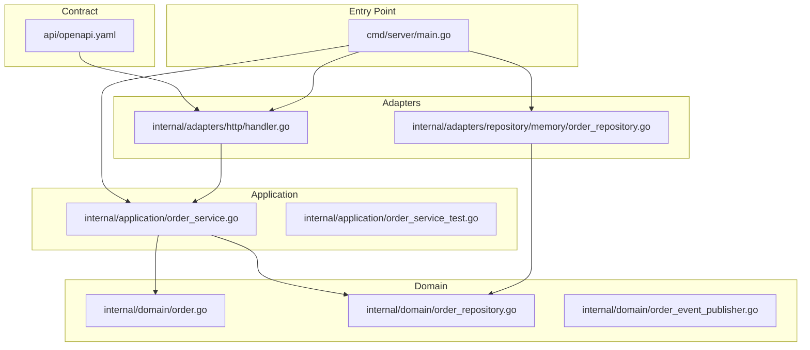

# リポジトリマップ

このファイルは、「どのファイルが何の責務を持つか」を最短で掴むための案内です。

## 俯瞰図

## ファイルごとの意味

### 契約

- [api/openapi.yaml](/Users/mn/Documents/Codex/2026-06-03/aof-go-openapi-api-github-aof/api/openapi.yaml)
  - API の入力、出力、HTTP ステータスを定義する
  - 実装前に「何を約束するか」を先に固定する

### 起動点

- [cmd/server/main.go](/Users/mn/Documents/Codex/2026-06-03/aof-go-openapi-api-github-aof/cmd/server/main.go)
  - 依存関係の組み立て
  - HTTP サーバ起動
  - 実行環境の設定値読み込み

### adapter

- [internal/adapters/http/handler.go](/Users/mn/Documents/Codex/2026-06-03/aof-go-openapi-api-github-aof/internal/adapters/http/handler.go)
  - HTTP request を usecase 入力へ変換する
  - usecase 結果を HTTP response へ変換する

- [internal/adapters/repository/memory/order_repository.go](/Users/mn/Documents/Codex/2026-06-03/aof-go-openapi-api-github-aof/internal/adapters/repository/memory/order_repository.go)
  - `OrderRepository` interface のインメモリ実装
  - 学習初期段階で DB を持ち込まないための足場

### application

- [internal/application/order_service.go](/Users/mn/Documents/Codex/2026-06-03/aof-go-openapi-api-github-aof/internal/application/order_service.go)
  - Create / Get のユースケース本体
  - domain と repository をつなぐ
  - `Clock` と `IDGenerator` により外部要素を差し替え可能にする

- [internal/application/order_service_test.go](/Users/mn/Documents/Codex/2026-06-03/aof-go-openapi-api-github-aof/internal/application/order_service_test.go)
  - usecase を adapter 非依存で検証する
  - stub を使って時刻・ID を固定する

### domain

- [internal/domain/order.go](/Users/mn/Documents/Codex/2026-06-03/aof-go-openapi-api-github-aof/internal/domain/order.go)
  - 注文エンティティ
  - 生成時のバリデーション
  - 業務ルール違反のエラー定義

- [internal/domain/order_repository.go](/Users/mn/Documents/Codex/2026-06-03/aof-go-openapi-api-github-aof/internal/domain/order_repository.go)
  - 保存先の抽象
  - Spanner へ差し替えるときの境界線

- [internal/domain/order_event_publisher.go](/Users/mn/Documents/Codex/2026-06-03/aof-go-openapi-api-github-aof/internal/domain/order_event_publisher.go)
  - 将来の Pub/Sub イベント発行の抽象
  - まだ未使用だが、教材として拡張点を見せるために置いている

## この構成で得られること

- GCP SDK を adapter に閉じ込めやすい
- HTTP と DB の都合で usecase が汚れにくい
- Step ごとに差し替える対象が明確になる

## 読み進めるコツ

- まず `api` と `cmd/server` を読む
- 次に `handler` と `order_service` の往復を見る
- 最後に `domain` と `repository` の境界が妥当か確認する
