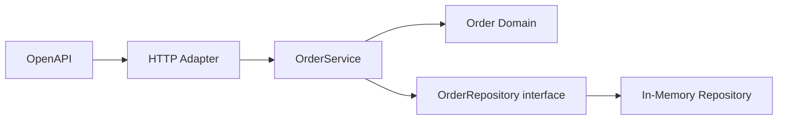
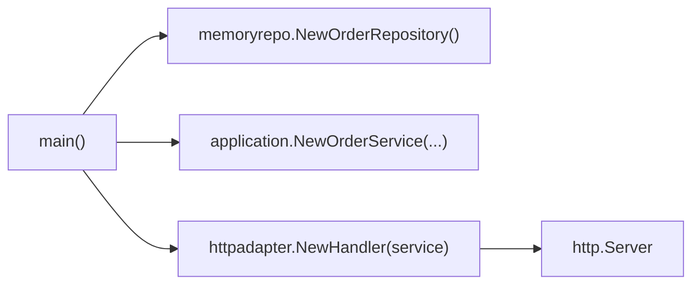

# Step 1: OpenAPI + Go + In-Memory

この STEP は、この repo の最小実装を読み解く入口です。  
ここで学ぶのは「まず動く API を作ること」ではなく、「将来の GCP 拡張を壊さない最小構成をどう切るか」です。

## この STEP で扱うもの

## 読む順番

1. [api/openapi.yaml](/Users/mn/Documents/Codex/2026-06-03/aof-go-openapi-api-github-aof/api/openapi.yaml)
2. [cmd/server/main.go](/Users/mn/Documents/Codex/2026-06-03/aof-go-openapi-api-github-aof/cmd/server/main.go)
3. [internal/adapters/http/handler.go](/Users/mn/Documents/Codex/2026-06-03/aof-go-openapi-api-github-aof/internal/adapters/http/handler.go)
4. [internal/application/order_service.go](/Users/mn/Documents/Codex/2026-06-03/aof-go-openapi-api-github-aof/internal/application/order_service.go)
5. [internal/domain/order.go](/Users/mn/Documents/Codex/2026-06-03/aof-go-openapi-api-github-aof/internal/domain/order.go)
6. [internal/domain/order_repository.go](/Users/mn/Documents/Codex/2026-06-03/aof-go-openapi-api-github-aof/internal/domain/order_repository.go)
7. [internal/adapters/repository/memory/order_repository.go](/Users/mn/Documents/Codex/2026-06-03/aof-go-openapi-api-github-aof/internal/adapters/repository/memory/order_repository.go)

## この STEP で作っているファイルと意味

- [api/openapi.yaml](/Users/mn/Documents/Codex/2026-06-03/aof-go-openapi-api-github-aof/api/openapi.yaml): API 契約。外部との約束を先に固定する
- [cmd/server/main.go](/Users/mn/Documents/Codex/2026-06-03/aof-go-openapi-api-github-aof/cmd/server/main.go): 依存関係を組み立てる起動点
- [internal/adapters/http/handler.go](/Users/mn/Documents/Codex/2026-06-03/aof-go-openapi-api-github-aof/internal/adapters/http/handler.go): HTTP と usecase の橋渡し
- [internal/application/order_service.go](/Users/mn/Documents/Codex/2026-06-03/aof-go-openapi-api-github-aof/internal/application/order_service.go): 業務の流れをつなぐユースケース
- [internal/domain/order.go](/Users/mn/Documents/Codex/2026-06-03/aof-go-openapi-api-github-aof/internal/domain/order.go): 注文のルールと不変条件
- [internal/domain/order_repository.go](/Users/mn/Documents/Codex/2026-06-03/aof-go-openapi-api-github-aof/internal/domain/order_repository.go): 保存先の抽象化
- [internal/domain/order_event_publisher.go](/Users/mn/Documents/Codex/2026-06-03/aof-go-openapi-api-github-aof/internal/domain/order_event_publisher.go): 将来の Pub/Sub 拡張点を先置き
- [internal/adapters/repository/memory/order_repository.go](/Users/mn/Documents/Codex/2026-06-03/aof-go-openapi-api-github-aof/internal/adapters/repository/memory/order_repository.go): 学習用の最小保存実装
- [internal/application/order_service_test.go](/Users/mn/Documents/Codex/2026-06-03/aof-go-openapi-api-github-aof/internal/application/order_service_test.go): usecase 単体で確認するテスト

## API からコードへの対応

### 1. OpenAPI で何を約束しているか

- `POST /orders`: 注文を受け付けて `201` を返す
- `GET /orders/{orderId}`: 注文を取得して `200` を返す
- `customerId`, `items`, `productId`, `quantity` が入力の基本項目

対応箇所:
- `POST /orders`: [api/openapi.yaml](/Users/mn/Documents/Codex/2026-06-03/aof-go-openapi-api-github-aof/api/openapi.yaml:12)
- `GET /orders/{orderId}`: [api/openapi.yaml](/Users/mn/Documents/Codex/2026-06-03/aof-go-openapi-api-github-aof/api/openapi.yaml:35)
- 入力スキーマ: [api/openapi.yaml](/Users/mn/Documents/Codex/2026-06-03/aof-go-openapi-api-github-aof/api/openapi.yaml:60)

### 2. 起動点で何を組み立てているか

`main.go` では、保存先、ユースケース、HTTP ハンドラを順番に配線しています。

ここで大事なのは、`main` が「実装の選択」を持ち、`application` と `domain` は「選ばれる側」に留まっていることです。

### 3. HTTP Adapter で何をしているか

- HTTP メソッドを判定する
- JSON を Go の struct に変換する
- usecase 入力へ詰め替える
- 戻り値を JSON に変換して返す

この分離により、HTTP を gRPC や Pub/Sub push に変えても、usecase 本体は極力そのままにできます。

### 4. Usecase で何をしているか

- request 由来の値を domain 入力へ変換する
- ID と時刻を注入する
- domain の生成ルールを呼ぶ
- repository へ保存する
- DTO に変換する

つまり `OrderService` は「業務の流れの司令塔」であり、保存形式や HTTP 詳細は持ちません。

### 5. Domain で何を守っているか

- `id` が空でない
- `customerId` が空でない
- item が 1 件以上ある
- `productId` が空でない
- `quantity` が 1 以上

このルールを domain に置くことで、将来 HTTP 以外の入口が増えても業務ルールがぶれにくくなります。

## この STEP の結果、何がもたらされるか

- API 契約と Go 実装の結びつきが見える
- 保存先をインメモリにしても、差し替え前提の構造を保てる
- GCP をまだ使わなくても、Cloud Run / Spanner / Pub/Sub への拡張ポイントを先に確保できる

## 初心者のつまづきポイント

- OpenAPI に `minimum` や `minLength` があっても、自動で Go 側が検証してくれるわけではない
- handler で validation しているように見えても、最終防衛線は domain に置くべき
- repository を interface にしただけでは不十分で、usecase が具体実装型を知らないことが大事
- In-Memory 実装が簡単なので、そのまま domain に保存処理を書きたくなるが避ける

## 意識しないといけない点

- `domain/usecase` から GCP SDK を import しない
- 生成時刻や ID を `time.Now()` / `uuid` に直書きしすぎず、差し替え可能にしておく
- HTTP の request / response struct を domain struct と混ぜない
- 将来の Spanner 実装で transaction を入れても、ユースケースの責務が膨らまない形を保つ

## ベテランからのアドバイス

- 先に adapter を簡単に作り、後で port を切るやり方は、教材としては学習負債になりやすい
- 「今は使っていない interface」は過剰設計に見えやすいが、教材では将来差し替え点を明示する価値が高い
- 初期実装のうちにエラーの意味を揃えておくと、Cloud Logging 導入時にログ解釈が楽になる

## 次に読む

- [docs/reference/repository-map.md](/Users/mn/Documents/Codex/2026-06-03/aof-go-openapi-api-github-aof/docs/reference/repository-map.md)
- [docs/reference/code-walkthrough.md](/Users/mn/Documents/Codex/2026-06-03/aof-go-openapi-api-github-aof/docs/reference/code-walkthrough.md)
- [docs/services/cloud-run.md](/Users/mn/Documents/Codex/2026-06-03/aof-go-openapi-api-github-aof/docs/services/cloud-run.md)
