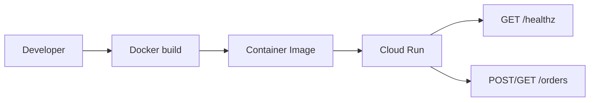

# Step 2: Cloud Run

この STEP では、Step 1 のローカル API を「Cloud Run に載せる前提の構成」に育てます。

## この STEP の狙い

- ローカル実装と Cloud Run 実行の差分を理解する
- コンテナ化、ヘルスチェック、実行主体、デプロイ設定を教材として読めるようにする

## 追加したファイル

- [Dockerfile](/Users/mn/Documents/Codex/2026-06-03/aof-go-openapi-api-github-aof/Dockerfile)
- [.dockerignore](/Users/mn/Documents/Codex/2026-06-03/aof-go-openapi-api-github-aof/.dockerignore)
- [infra/cloud-run/service.yaml](/Users/mn/Documents/Codex/2026-06-03/aof-go-openapi-api-github-aof/infra/cloud-run/service.yaml)
- [infra/cloud-run/README.md](/Users/mn/Documents/Codex/2026-06-03/aof-go-openapi-api-github-aof/infra/cloud-run/README.md)

## この教材で使う実値

- `Project ID`: `gcp-service-learning`
- `Region`: `asia-northeast1`
- `Artifact Registry repository`: `gcp-service-learning`

この 3 つが同じ名前系統でも問題ありません。  
`Project` と `Repository` は別リソースなので、教材としてはむしろ追いやすいです。

## コードで変えた点

### 1. `/healthz` を追加

対象:
- [internal/adapters/http/handler.go](/Users/mn/Documents/Codex/2026-06-03/aof-go-openapi-api-github-aof/internal/adapters/http/handler.go)
- [api/openapi.yaml](/Users/mn/Documents/Codex/2026-06-03/aof-go-openapi-api-github-aof/api/openapi.yaml)

何をしているか:
- ヘルスチェック用の GET エンドポイントを追加した

結果:
- Cloud Run の probe や手動確認に使いやすくなる

### 2. graceful shutdown を追加

対象:
- [cmd/server/main.go](/Users/mn/Documents/Codex/2026-06-03/aof-go-openapi-api-github-aof/cmd/server/main.go)

何をしているか:
- `SIGTERM` を受けたら `server.Shutdown` を呼ぶ

結果:
- Cloud Run の停止時に、いきなりプロセス終了するより安全になる

### 3. container build を追加

対象:
- [Dockerfile](/Users/mn/Documents/Codex/2026-06-03/aof-go-openapi-api-github-aof/Dockerfile)

何をしているか:
- Go バイナリを build して、distroless イメージで実行する

結果:
- Cloud Run に載せる最小コンテナとして成立する

## 構成図

## UI でどこを見るか

1. `Artifact Registry > リポジトリ`
   - `gcp-service-learning`
   - format が `Docker`
   - region が `asia-northeast1`
2. `Cloud Run > サービスを作成`
   - region が `asia-northeast1`
   - image が `asia-northeast1-docker.pkg.dev/gcp-service-learning/gcp-service-learning/order-api:latest`
3. `IAM と管理 > サービス アカウント`
   - 実行用 SA を分けるか確認する

## 初心者のつまづきポイント

- `PORT` は Cloud Run から渡される前提で、ローカル固定値とは考え方が違う
- viewer や `.aof` と違って、アプリ本体は stateless に保つ意識が必要
- In-Memory Repository は Cloud Run の複数インスタンスや再起動では保持されない

## PM 観点で意識すること

- `minScale` を 0 にするとコストは下がるが、コールドスタートの体感に影響する
- 同期 API の `timeoutSeconds` は業務要件とコストに直結する
- 公開 API にするか認証付き API にするかで IAM と運用が変わる

## ベテランからのアドバイス

- Cloud Run に載せる前に `/healthz` を入れておくと、障害切り分けが圧倒的に楽になる
- 初期段階では distroless で十分だが、デバッグ方針も別途決めておくと運用が安定する
- In-Memory のまま Cloud Run に載せるのは「教材として差分を学ぶため」であり、本番設計ではないと明記しておく

## 次に読む

- [docs/services/cloud-run.md](/Users/mn/Documents/Codex/2026-06-03/aof-go-openapi-api-github-aof/docs/services/cloud-run.md)
- [infra/cloud-run/README.md](/Users/mn/Documents/Codex/2026-06-03/aof-go-openapi-api-github-aof/infra/cloud-run/README.md)
- [docs/services/iam.md](/Users/mn/Documents/Codex/2026-06-03/aof-go-openapi-api-github-aof/docs/services/iam.md)
