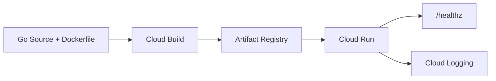
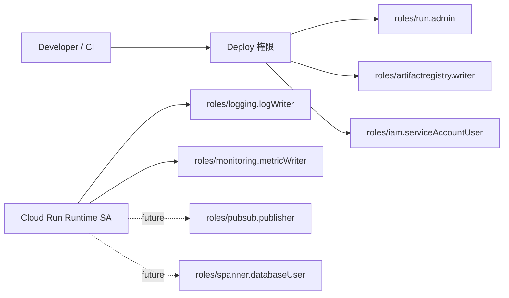

# Step 3: Deploy And IAM

この STEP では、Cloud Run に実際に載せるための API 有効化、IAM、build / push / deploy の流れを学びます。

## この STEP の狙い

- ローカルアプリを GCP 上のサービスとして公開する手順を理解する
- デプロイ権限と実行権限を分離する意味を理解する
- UI 操作と CLI 操作の対応を把握する

## 読むファイル

- [infra/cloud-run/apis-and-iam.md](/Users/mn/Documents/Codex/2026-06-03/aof-go-openapi-api-github-aof/infra/cloud-run/apis-and-iam.md)
- [infra/cloud-run/deploy.sh](/Users/mn/Documents/Codex/2026-06-03/aof-go-openapi-api-github-aof/infra/cloud-run/deploy.sh)
- [docs/services/iam.md](/Users/mn/Documents/Codex/2026-06-03/aof-go-openapi-api-github-aof/docs/services/iam.md)
- [docs/network-and-security.md](/Users/mn/Documents/Codex/2026-06-03/aof-go-openapi-api-github-aof/docs/network-and-security.md)

## この教材で使う実値

- `Project ID`: `gcp-service-learning`
- `Region`: `asia-northeast1`
- `Artifact Registry repository`: `gcp-service-learning`
- `Cloud Run service name`: `order-api`

## UI でやること

1. `API とサービス > 有効な API とサービス`
   - Cloud Run
   - Artifact Registry
   - Cloud Build
   - IAM
   - Cloud Logging
   - Cloud Monitoring
2. `IAM と管理 > サービス アカウント`
   - `order-api-runtime` を作る
3. `Artifact Registry > リポジトリ`
   - `gcp-service-learning` が Docker / asia-northeast1 であることを確認
4. `Cloud Run > サービスを作成`
   - image を指定
   - region を `asia-northeast1`
   - service account を `order-api-runtime`

## CLI でやること

```bash
chmod +x infra/cloud-run/deploy.sh
./infra/cloud-run/deploy.sh
```

この script は以下をまとめて実行します。

- 必要 API の有効化
- Docker 認証設定
- Cloud Build による image build
- Cloud Run deploy

## デプロイフロー図



## IAM 分離図



## 初心者のつまづきポイント

- repository 名と image 名は別物
- `Project ID` と `Artifact Registry repository` が同じでも問題ない
- Cloud Run 作成に失敗しても、原因は Cloud Build や IAM のことがある

## PM 観点で意識すること

- 権限が揃わないとデプロイ計画そのものが止まる
- 認証なし公開にするかは、学習都合と案件要件を分けて扱う

## ベテランからのアドバイス

- 最初は UI で作ってもよいが、再現手順は必ず script か IaC に寄せる
- 「誰が build/deploy できるか」と「アプリが何に触れるか」を同じ議論にしない
